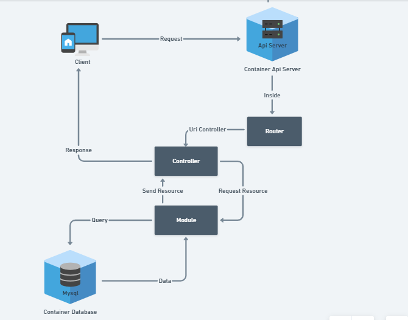
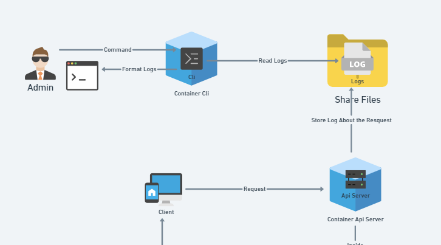

<h1> <strong>Rest Api in C</string></h1>

> Docker used for Contanization

[](https://www.docker.com/)

<br>

<h2> <strong> Contents </strong> </h2>

* [About](#about)
* [Http Routes](#routes)
* [Tools](#tools)
* [Docker](#docker)
* [Simple Commands](#simple)
* [Fluxogramas](#flux)
* [Documentation](#doc)
* [Collaborators](#collab)

<br>
<h2 id = "about"><strong>About</strong></h2>
<hr>

This is a one week project where the objective is to create a Rest Api and a Cli using C and any supplemental library. This challange is an opportunity to take the first step towards the job market with [42](https://42.fr/en/network-42/).

<br>
<h2  id = "routes"><strong>HTTP Routes</strong></h2>
<table width="80%">
  <tr>
    <th>Method</th>
    <th>Uri</th>
  </tr>
  <tr>
    <td>/</td>
    <td>GET</td>
  </tr>
  <tr>
    <td>/pokemon</td>
    <td>GET</td>
  </tr>
  <tr>
    <td>/pokemon</td>
    <td>POST</td>
  </tr>
  <tr>
    <td>/pokemon/$(id)</td>
    <td>GET</td>
  </tr>
  <tr>
    <td>/pokemon/$(id)</td>
    <td>PUT</td>
  </tr>
  <tr>
    <td>/pokemon/$(id)</td>
    <td>DELETE</td>
  </tr>
</table>


<br>
<h2 id= "tools"><strong>Tools and Technologies</strong></h2>

* [Mongoose](https://mongoose.ws/documentation/) as a network library to accept http request

* [Mysql](https://www.mysql.com/) to stored our data into a relational database

* [Mysql C Lib](https://dev.mysql.com/doc/c-api/8.0/en/) to connect our C server into the database

* [Docker](https://www.docker.com/) to separete our Api, Cli And Database in containers
* [Development tools](https://www.a2hosting.com/kb/developer-corner/testing-and-development/installing-development-tools-on-an-unmanaged-server) such as git, gcc and make

* [Organization Tools](https://www.a2hosting.com/kb/developer-corner/testing-and-development/installing-development-tools-on-an-unmanaged-server) 

* *  [Whimsical](https://whimsical.com/fluxograma-UMDgypwLJykZyjAaKEtaSw) a Web Application to make fluxograma

* *  [Monday](https://celebro-company.monday.com/boards/2325319253) To plan priorities

* * 

* *  [Notion](https://rust-politician-f9e.notion.site/459a97270f194a3d87020351736f1dfa?v=81110b2cb5ef41e0a13a113bcf952686) To organize what and when to study a subject

* Tools to test our api

* *  [Postman](https://www.postman.com/)

* *  [Thunderclient](https://www.thunderclient.com/)

* *  [RestClient](https://marketplace.visualstudio.com/items?itemName=humao.rest-client)

<br>
<h2 id = "docker"><strong>Docker and Server instalation</strong></h2>

> The image is privated but in the future i wish to lauch it.

> Make sure you have [Docker](https://docs.docker.com/engine/) installed in your environment

> I'm not using docker-composer since this was a one week project, but i will implement it in the next project

<h3><strong>Building Server</strong></h3>

* Images needed:

* ```
  docker pull mysql
  docker pull ubuntu
  docker pull debian
* Volumes: 

* ```
    docker volume create --name Logs
    docker volume create --name Database-volume
* Build:
* ```
  	docker build -t api ./Api
	  docker build -t cli ./Cli
  	docker build -t my_sql ./Database
* Network:

* ```
  docker network create database_network
* Run:
* ```
    docker run --network database_network -v Database-volume:/var/lib/mysql --name=mysql_container my_sql #wait set up then close the terminal and open again, or use -d flag and wait a minute to give time to the database start
    docker run -ti -d  --network database_network --name=api_container -p 8000:8000 -v Logs:/Logs api
* Now the Api server is up and can be accessed throught localhost:8000
* try access localhost:8000/pokemon as a test. If the container connection stop it means the mysql doesn't finish its set up, just run ```docker start api_container``` again and the application will work normally
* You can use docker commands to manage the containers


<h2 id="simple"><strong> Simple Commands </strong></h2>

* ```
  docker stop [container]
  docker start [container]
  docker run -ti --rm --volumes-from api_container cli#open cli and navegate throught the logs
<h2 id = "flux"> <strong>Api Fluxograma</strong></h2>



<br>
<h2> <strong>Cli Fluxograma</strong></h2>



<br>

<h2 id = "doc"><strong> Documentation</strong></h2>

> **Host**/**Endpoint**

> Considere localhost:800 as the <strong>Host</strong>
*  http://localhost:8000/

* * ```
    Brief: Initial page
    Response:
      status 200
      json with welcome message
*  http://localhost:8000/pokemon

* * ```
    Brief: Returns in json all the pokemons stored into the database
    Response:(json)
    [
      {
        "name": "Bulbasaur",
        "type": "Grass"
      },
       {
        "name": "Charmeleon",
        "type": "Fire"
      },
      {
        "name": "Blastoise",
        "type": "Water"
      }
      ...
      ...
      ...
    ]
*  http://localhost:8000/pokemon/1
* * ```
    Brief: Return a json array with the pokemon of id
    Response:(json)
    [
      {
        "name": "Bulbasaur",
        "type": "Grass"
      }
    ]
*  http://localhost:8000/pokemon
* * ```
      Brief: Create a new pokemon into the database
    
      Request:(json)
      {
        "name": "my_new_pokemon",
        "type": "my_type"
      }
      Response:
          status 202 in success
          status 500 or 400 in case of error
*  http://localhost:8000/pokemon/1
* * ```
      Brief: Update a pokemon of id with new values
    
      Request:(json)
      {
        "name": "my_new_pokemon",
        "type": "my_type"
      }
      Response:
         status 200 in success
         status 500 in case of error
*  http://localhost:8000/pokemon/1
* * ```
      Brief: Delete pokemon of id
      Response:
         status 200 in success
         status 500 in case of error
<br>
<h2><strong>Cli Documentation</strong></h2>

> Cli provides 3 interfaces

1. Total Requests


2. Show all Requests of a pair Method Uri


3. Show information about an specific request


* You can press [space] to see the menu helper
* Navegate throught the table using w/s or up down
* Select an item with [enter]
* [backspace] to return to the previous page
* [q] to exit the application

<br>

<hr>
<h2 id="collab">Collaborators</h2>
<hr>

* Gabriel (gsilva-v)
* Leonardo (lfilipe-)
<hr>
<h2 id="bio"><strong>Bibliography</strong></h2>
<hr>

 [Notion](https://rust-politician-f9e.notion.site/459a97270f194a3d87020351736f1dfa?v=81110b2cb5ef41e0a13a113bcf952686) Most part of the links used is inside notion
